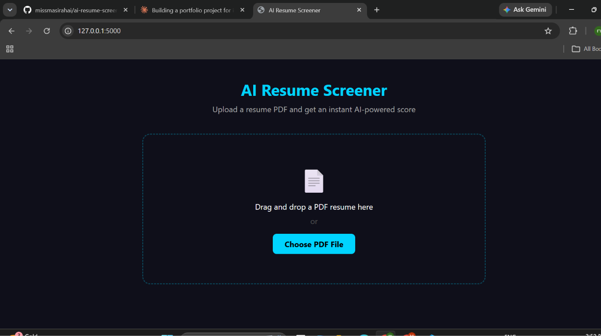
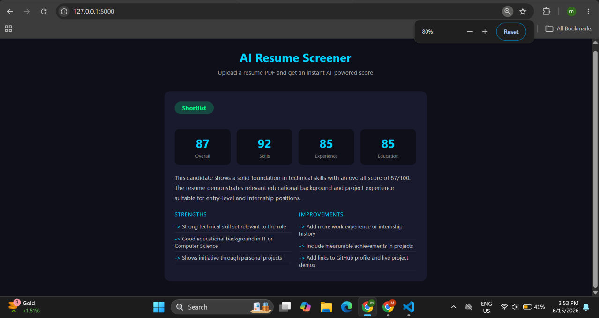

# 🤖 AI Resume Screener

A full stack web application that analyzes resumes instantly
and provides AI-powered scoring with detailed feedback.

Built by a 2nd year BSc IT student as a portfolio project.

---

## 🔗 Live Demo

[View Live App](https://ai-resume-screener.onrender.com)

---

## 📸 Screenshots

### Upload Page


### Result Dashboard


---

## ⚙️ Tech Stack

| Layer | Technology |
|---|---|
| Frontend | HTML5, CSS3, JavaScript |
| Backend | Python 3, Flask |
| PDF Processing | PyPDF2 |
| AI Engine | Anthropic Claude API |
| Deployment | Render.com |
| Version Control | Git and GitHub |

---

## ✨ Features

- Drag and drop PDF resume upload
- Instant AI-powered resume scoring
- Scores across 4 categories
- Verdict — Shortlist, Maybe, or Reject
- Strengths and improvement suggestions
- Responsive dark UI

---

## 🚀 Installation

### Step 1 — Clone the Repository
```bash
git clone https://github.com/missmasirahai/ai-resume-screener.git
cd ai-resume-screener
```

### Step 2 — Create Virtual Environment
```bash
python -m venv venv
venv\Scripts\activate
```

### Step 3 — Install Dependencies
```bash
pip install -r requirements.txt
```

### Step 4 — Set Environment Variable
Create a `.env` file and add:

ANTHROPIC_API_KEY=your_api_key_here

### Step 5 — Run the Application
```bash
python app.py
```

### Step 6 — Open in Browser

http://127.0.0.1:5000

---

## 📁 Project Structure
ai-resume-screener/

│

├── static/

│   ├── css/

│   │   └── style.css

│   └── js/

│       └── main.js

│

├── templates/

│   └── index.html

│

├── screenshots/

│   ├── screenshot1.png

│   └── screenshot2.png

│

├── app.py

├── requirements.txt

├── .env

├── .gitignore

└── README.md

---

## 🎯 How It Works

1. User uploads a PDF resume
2. Flask backend receives and saves the file
3. PyPDF2 extracts all text from the PDF
4. Scoring engine analyzes keywords and content
5. Scores calculated for Skills, Experience, Education
6. Results displayed dynamically without page reload

---

## 🔮 Future Improvements

- Full Claude AI API integration
- User authentication and resume history
- Export results as PDF report
- Job description matching feature
- PostgreSQL database integration

---

## 👤 About the Developer

BSc Information Technology Student, 2nd Year

Passionate about Full Stack Development and AI integration.

- GitHub: [@missmasirahai](https://github.com/missmasirahai)
- Email: missmasirah.work@gmail.com

---

## 📄 License

This project is open source under the MIT License.